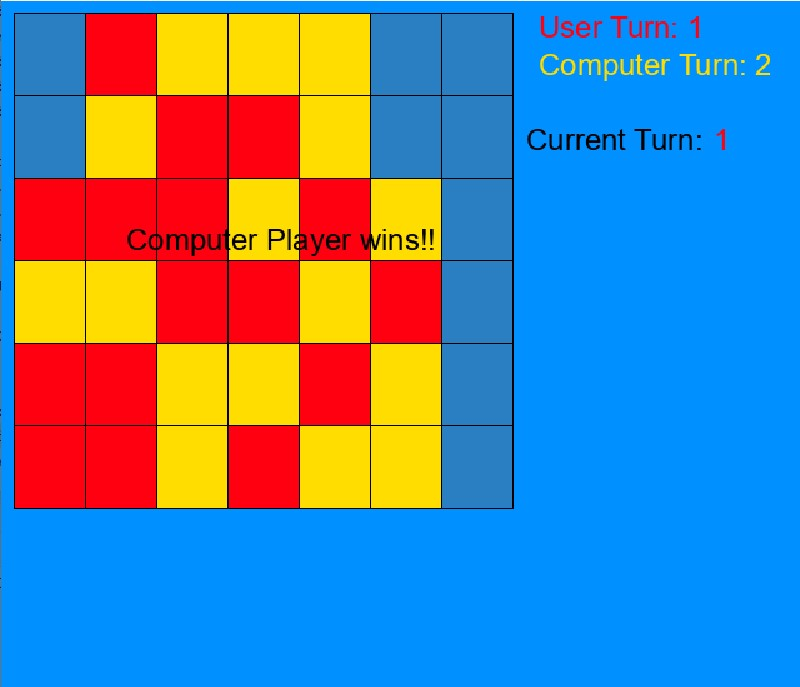

# Connect 4 AI
The Connect 4 AI class uses a recursive function to loop over the decision trees to a depth of 6. 

The AI class also uses a minimax function and a heuristic function to find the best possible move.

The heuristic function checks for win or loss and 3 in a row with an empty space for either player.

Graphics Framework created by David Dobervich NOT included
